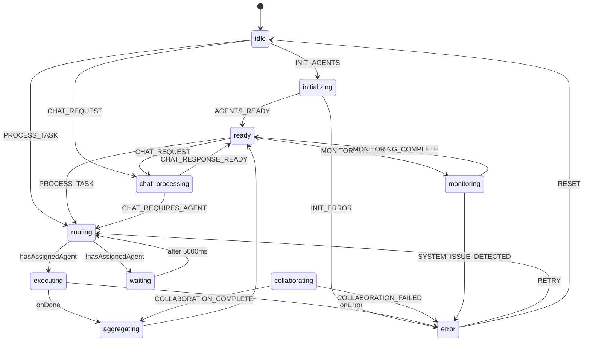
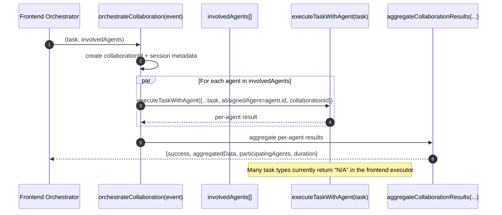
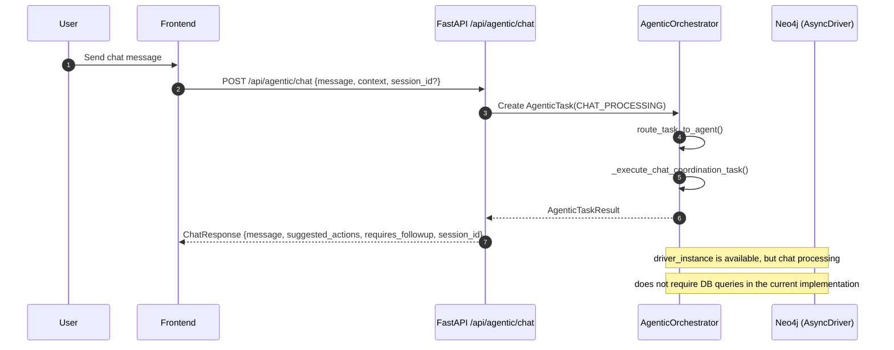
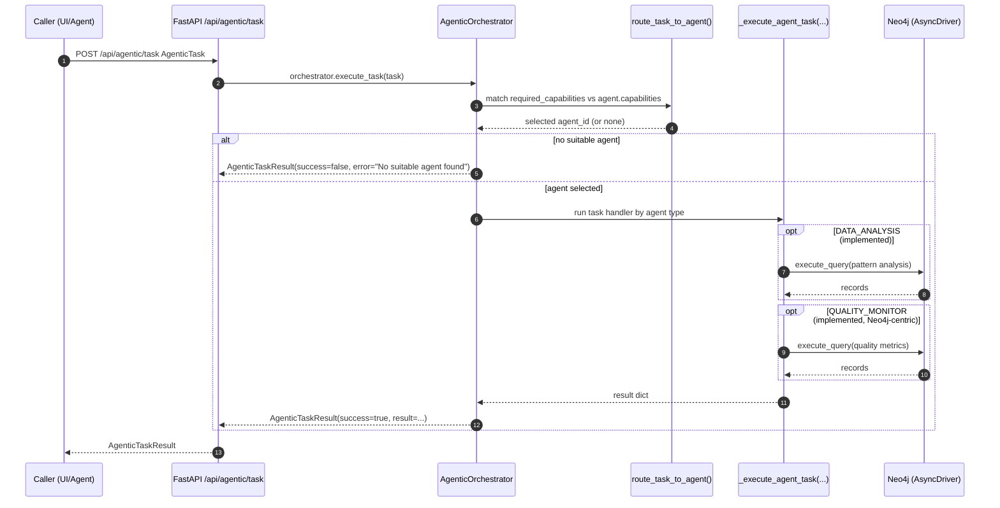
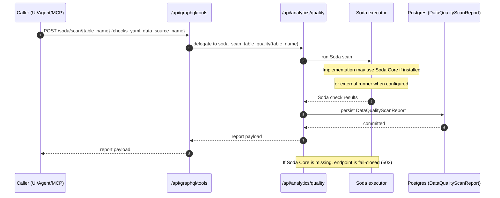
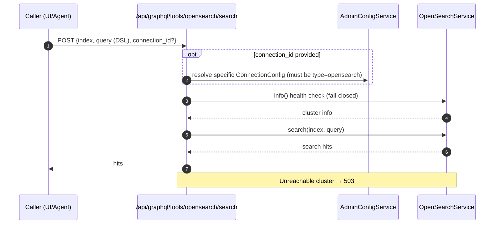
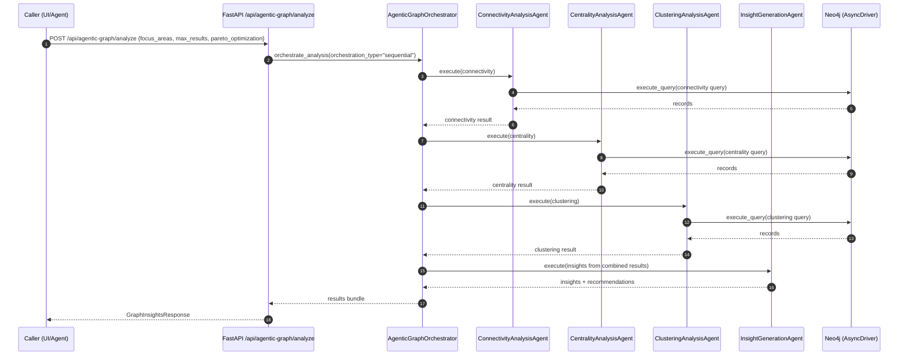
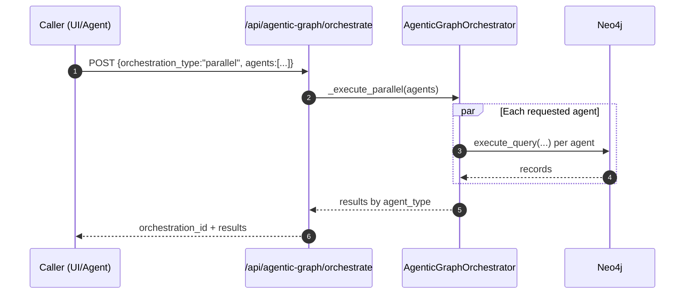
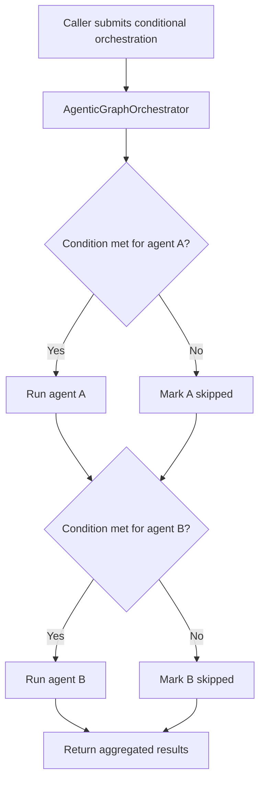
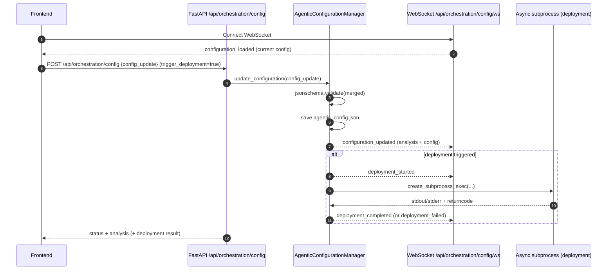

# Agentic Interaction Workflow (Current Code)

This document describes the **agentic interaction workflows that exist in the current codebase**, and provides Mermaid diagrams you can render in GitHub/VS Code.

> Scope note
>
> - The repo contains **two orchestration planes**:
>   1) a **frontend XState orchestrator** (currently only fully wired for PLM ETL execution; several task types are explicitly “N/A”)
>   2) a **backend FastAPI orchestrator** (routes tasks to agent implementations; currently Neo4j-centric)
> - Separately, the backend exposes **“GraphQL toolkit” + “GraphQL tools” endpoints** for orchestration-style tool calls (connectors, Soda scan, OpenSearch search, OpenSearch AD gatekeeper).
> - An **MCP Soda server** is provided that calls backend endpoints (it does not import Soda Core directly).

## Key entrypoints (files + endpoints)

### Frontend
- `e2etraceapp/src/services/agentic-orchestrator.js`
  - XState machine: `agenticWorkflowMachine`
  - Task executor: `executeTaskWithAgent(task)`
  - Fully wired execution path: `PIPELINE_ORCHESTRATION` → `/api/plm/etl/*`
  - Not yet wired (returns “N/A” message): `GRAPH_QUERY`, `DATA_ANALYSIS`, `VISUALIZATION_GENERATION`, `QUALITY_ASSESSMENT`

### Agent roster (what “various agents” exist today)

The repo defines these agent types in both frontend and backend orchestration layers.

#### Frontend agent types (from `agentic-orchestrator.js`)

| Agent type | Intent (high-level) | Notes on current wiring |
|---|---|---|
| `data_analyst` | insights / analysis | task handler returns “N/A” today |
| `etl_orchestrator` | ETL execution | **wired** for PLM ETL (`PIPELINE_ORCHESTRATION`) |
| `query_planner` | query planning | task handler returns “N/A” today |
| `visualization_agent` | visualization generation | task handler returns “N/A” today |
| `quality_monitor` | quality assessment | task handler returns “N/A” today |
| `chat_coordinator` | chat coordination | returns a limited “ready” response |

#### Backend agent types (from `graph_api/agentic_router.py`)

| Agent type | How it’s used | Multi-agent behavior |
|---|---|---|
| `data_analyst` | can execute Neo4j pattern analysis | **single-agent per task** |
| `etl_orchestrator` | returns generic ETL advice | **single-agent per task** |
| `query_planner` | generates simple NL→Cypher suggestion | **single-agent per task** |
| `visualization_agent` | recommends layouts based on complexity | **single-agent per task** |
| `quality_monitor` | computes Neo4j-centric quality score | **single-agent per task** |
| `chat_coordinator` | intent + followup suggestions | **single-agent per task** |

> Important distinction
>
> - **Backend `/api/agentic/*`** routes a task to *one best agent*.
> - **Backend `/api/agentic-graph/*`** explicitly orchestrates *multiple* specialized agents.
> - **Frontend collaboration helper** can fan-out to multiple agents, but is not currently triggered by the state machine transitions.

- `e2etraceapp/src/services/GraphIntegrationService.js`
  - GraphQL toolkit: `/api/graphql/*`
  - GraphQL tools (orchestration): `/api/graphql/tools/*`
    - `GET /api/graphql/tools/connectors`
    - `GET /api/graphql/tools/connectors/default/{connection_type}`
    - `POST /api/graphql/tools/opensearch/search`
    - `POST /api/graphql/tools/soda/scan/{table_name}`
    - `POST /api/graphql/tools/opensearch-ad/gate/{result_index}`

  ## UI alignment audit: Queries, Reports, Workflows Wizard

  This section is an **implementation-level review** of whether the UI screens the user can click through are actually wired to the backend workflow/tooling described above.

  ### What the UI currently exposes (routes)

  | UI surface | Route | Primary component | Notes |
  |---|---|---|---|
  | Queries (Query Builder + Saved Queries) | `/analytics` | `e2etraceapp/src/pages/analytics/EnterpriseAnalyticsHub.jsx` | Contains Query Builder, Natural Language, Quality Reports, Saved Queries |
  | Reports (Quality reports) | `/analytics?tab=quality-reports` (legacy redirects) | `EnterpriseAnalyticsHub.jsx` | Quality reports list + detail view |
  | Workflows Wizard (PLM Migration) | `/migration` | `e2etraceapp/src/components/migration-wizard/MigrationWizard.jsx` | 5-step wizard (Connect → Discovery → Map → Validate → Execute) |
  | Workflow manager (list/discovery) | `/workflow-manager` | `e2etraceapp/src/pages/workflow-manager/WorkflowManagerPage.jsx` | Lists workflows via `GET /api/workflows` and links to detail |
  | Workflow instance detail | `/workflow/:workflowId` and `/graph-explorer/workflow/:workflowId` | `e2etraceapp/src/pages/workflow-manager/WorkflowDetailPage.jsx` | Shows live progress + archive; linked from `/workflow-manager` |

  > Not currently reachable from navigation
  >
  > - `e2etraceapp/src/components/data-pipeline-wizard.jsx` exists but is not routed to from `src/routes/index.jsx`.

  ### Queries ✅ (wired)

  | UI action | Frontend file(s) | Backend endpoint(s) | Status |
  |---|---|---|---|
  | Execute SQL | `EnterpriseAnalyticsHub.jsx` | `POST /api/analytics/sql` (in `python_backend/graph_api/analytics_router.py`) | ✅ |
  | Execute Cypher | `EnterpriseAnalyticsHub.jsx` | `POST /api/lineage/cypher` (in `python_backend/graph_api/lineage_router.py`) | ✅ |
  | Execute OpenSearch DSL | `EnterpriseAnalyticsHub.jsx` | `POST /api/opensearch/search/{index}` (in `python_backend/graph_api/opensearch_router.py`) | ✅ |
  | Execute GraphQL (db-query) | `EnterpriseAnalyticsHub.jsx` | `POST /api/graphql/db-query` (in `python_backend/graph_api/graphql_router.py`) | ✅ |
  | Save/list persisted GraphQL queries | `EnterpriseAnalyticsHub.jsx`, `hooks/useGraphQL.js`, `services/GraphIntegrationService.js` | `GET/POST /api/graphql/catalogue/queries` (in `python_backend/graph_api/graphql_catalogue_router.py`) | ✅ |

  ### Reports ⚠️ (partially wired)

  | UI action | Frontend file(s) | Backend endpoint(s) | Status |
  |---|---|---|---|
  | List quality reports | `EnterpriseAnalyticsHub.jsx` | `GET /api/analytics/quality/reports` | ✅ |
  | View quality report detail | `EnterpriseAnalyticsHub.jsx` | `GET /api/analytics/quality/reports/{scan_id}` | ✅ |
  | Run a new Postgres quality scan and persist a report | `EnterpriseAnalyticsHub.jsx` | `POST /api/analytics/quality/scan/{table_name}` | ✅ (fixed wiring) |
  | Run a generic scan for non-Postgres sources | `EnterpriseAnalyticsHub.jsx` | `POST /api/analytics/quality/scan` | ✅ persists into `/reports` when Postgres is configured (`persisted: true`) |
  | Export report | `EnterpriseAnalyticsHub.jsx` | `GET /api/analytics/quality/reports/{scan_id}` | ✅ exports JSON (full) + CSV (summary) |

  Notes:
  - The persisted reports that power the UI table come from **Postgres-backed** scans (`/scan/{table}`) and Soda-based scans (`/soda/scan/{table}`), plus OpenSearch AD gate reports.
  - The UI currently treats “Run New Scan” as a persisted operation only for **Postgres**.

  ### Workflows Wizard ✅/⚠️ (mixed)

  | Wizard step | Frontend file(s) | Backend endpoint(s) | Status |
  |---|---|---|---|
  | Connect: choose data sources | `MigrationWizard.jsx`, `config/api-config.js` | `GET /api/data-sources` (and related) | ✅ (assumes backend provides a catalog) |
  | Discovery: stage sample, transform, run Soda gate | `MigrationWizard.jsx` | `POST /api/plm/etl/runs`, `POST /api/plm/etl/runs/{run_id}/stage`, `POST /api/plm/etl/runs/{run_id}/transform`, `POST /api/plm/etl/runs/{run_id}/dq/soda/scan/{table}` and `GET /api/plm/etl/runs/{run_id}/dq/gates` | ✅ (best-effort; Soda may fail-closed with 503 depending on env) |
  | Audit/state tracking (MCP run tracking) | `MigrationWizard.jsx` | `POST /api/migrations/runs` and related transition/materialize/publish endpoints | ✅ (best-effort; wizard continues without it) |
  | Validate: explicit Soda scan button (gate) | `MigrationWizard.jsx` | `POST /api/plm/etl/runs/{run_id}/dq/soda/scan/{table}` | ✅ |
  | Execute: workflow execution + monitoring | `MigrationWizard.jsx`, `WorkflowDetailPage.jsx` | `POST /api/workflows/{workflowId}/execute`, `GET /api/workflows/{workflowId}/archive`, WS updates under `/api/orchestration/config/*` | ⚠️ depends on which execution path the user takes; detail page is wired but there is no workflow list UI |

  ### UX mismatches / gaps (actionable checklist)

  | Item | Impact | Where | Status |
  |---|---|---|---|
  | Deep links like `/analytics?tab=quality-reports` were ignored | Legacy redirects landed on the wrong tab | `EnterpriseAnalyticsHub.jsx`, `src/routes/index.jsx` | ✅ fixed (tab param now honored; `/reporting` redirect corrected) |
  | No workflow list/manager page | Users can open `/workflow/:id` but can’t discover workflows in UI | `src/routes/index.jsx` + `WorkflowManagerPage.jsx` | ✅ fixed (`/workflow-manager` now lists workflows) |
  | “Export report” button is a no-op | Confusing UI affordance | `EnterpriseAnalyticsHub.jsx` | ✅ fixed (JSON + CSV export) |
  | `data-pipeline-wizard.jsx` is not routed + hardcodes API base URL | Dead code + inconsistent configuration | `src/components/data-pipeline-wizard.jsx` | ❌ not aligned |


### Backend
- `python_backend/main.py`
  - mounts routers including:
    - `graph_api/agentic_router.py` at `/api/agentic/*`
    - `graph_api/graphql_tools_router.py` at `/api/graphql/tools/*`
    - `graph_api/quality_router.py` at `/api/analytics/quality/*`

- `python_backend/graph_api/agentic_router.py`
  - Task execution: `POST /api/agentic/task`
  - Chat: `POST /api/agentic/chat`
  - Status/agents/metrics: `/api/agentic/status`, `/api/agentic/agents`, ...

- `python_backend/graph_api/graphql_tools_router.py`
  - Connectors discovery + tool-style operations for orchestration agents
  - Uses:
    - `AdminConfigService` (connector resolution)
    - `OpenSearchService` (Query DSL search)
    - Delegates to `quality_router` for Soda scan + OpenSearch AD gate

- `python_backend/graph_api/quality_router.py`
  - Persisted data quality reports:
    - `GET /api/analytics/quality/reports`
    - `GET /api/analytics/quality/reports/{scan_id}`
  - Soda scan:
    - `POST /api/analytics/quality/soda/scan/{table_name}`
  - OpenSearch AD gatekeeper:
    - `POST /api/analytics/quality/opensearch-ad/gate/{result_index}`

### MCP
- `python_backend/mcp_servers/soda_server.py`
  - MCP tools call backend HTTP endpoints:
    - `run_soda_scan` → `/api/analytics/quality/soda/scan/{table_name}`
    - `get_scan_results` → `/api/analytics/quality/reports`
    - `analyze_anomaly` → `/api/analytics/quality/reports`
    - `check_opensearch_ad_results` → `/api/analytics/quality/opensearch-ad/gate/{result_index}`

## 🧩 System / component interaction map

```mermaid
flowchart LR
  subgraph FE[Frontend (Vite)]
    AO[agentic-orchestrator.js\nXState FSM]
    GIS[GraphIntegrationService.js\nAPI client]
  end

  subgraph BE[Backend (FastAPI)]
    AAPI[/\/api\/agentic\n(agentic_router)/]
    AGR[/\/api\/agentic-graph\n(agentic_graph_router)/]
    OCFG[/\/api\/orchestration\/config\n(agentic_config_router)/]
    GQLT[/\/api\/graphql\n(graphql_router)/]
    GQLTOOLS[/\/api\/graphql\/tools\n(graphql_tools_router)/]
    QUAL[/\/api\/analytics\/quality\n(quality_router)/]
  end

  subgraph CFG[Config + Connectors]
    ACFG[Admin Config DB\nConnectionConfig]
    ACS[AdminConfigService]
  end

  subgraph DQ[Quality Engines]
    SODA[Soda Core\n(or external runner)]
    OS[OpenSearch Cluster]
    AD[OpenSearch AD Plugin\n(custom result index)]
  end

  subgraph PERSIST[Persistence]
    PG[(Postgres)]
    DQR[(DataQualityScanReport)]
  end

  subgraph MCP[MCP Runtime]
    MCP_SODA[mcp_servers/soda_server.py\nstdio MCP server]
  end

  %% Frontend paths
  AO -->|only fully wired for\nPIPELINE_ORCHESTRATION| BE
  GIS --> BE

  %% Backend routers
  AAPI -->|Neo4j driver| BE
  AGR -->|Neo4j driver| BE
  GQLTOOLS --> ACS
  ACS --> ACFG

  %% Orchestration configuration
  GIS --> OCFG
  OCFG -. WebSocket .- FE

  %% Quality + OpenSearch
  GQLTOOLS -->|delegates| QUAL
  QUAL --> PG
  PG --> DQR

  QUAL --> SODA
  GQLTOOLS --> OS
  QUAL --> OS
  OS --> AD

  %% MCP path
  MCP_SODA -->|HTTP calls| QUAL

  %% Notes about current wiring
  AO -. QUALITY_ASSESSMENT currently returns "N/A" .-> GQLTOOLS
```

### Request gating (security + reliability)

At runtime, `python_backend/main.py` applies middleware that can affect **all** the flows below:

- **API key enforcement** (only if configured)
- **Rate limiting**
- Optional **RBAC** when auth is enabled: mutating `/api/*` calls require an `admin` role (except `/api/auth/*`)

When an upstream dependency is unavailable (OpenSearch unreachable, Soda missing, etc.), the tool endpoints generally **fail closed** with a `503`.

## 🔁 Frontend XState workflow (as implemented)

This is the state machine present in `agentic-orchestrator.js`.



## 🤝 Frontend multi-agent collaboration (helper flow)

The frontend has an explicit collaboration helper implemented at the bottom of `agentic-orchestrator.js`:
- `orchestrateCollaboration(event)`
- `executeAgentCollaborationTask(agent, task, collaborationId)`
- `aggregateCollaborationResults(results, collaboration)`

It performs a **parallel fan-out** (`Promise.all`) across `involvedAgents` and aggregates results.

> Current limitation: the XState machine *defines* a `collaborating` state, but there is no default transition into it in the current implementation.



## 💬 Backend agentic chat flow (`/api/agentic/chat`)

The backend chat endpoint wraps the message into an internal `AgenticTask` of type `CHAT_PROCESSING`, routes it to a suitable agent (typically the chat coordinator), and returns a structured response.



## 🧠 Backend task execution flow (`/api/agentic/task`)

This is the “backend agentic orchestrator” path implemented in `graph_api/agentic_router.py`.



> Note: this backend orchestrator currently does **not** invoke the `/api/graphql/tools/*` tool endpoints; it primarily executes Neo4j-centric routines.

### Backend agent-to-agent interaction (current reality)

In `graph_api/agentic_router.py`, a single `/api/agentic/task` request produces **one** selected agent execution.

- There is **no fan-out** to multiple agents in one request.
- “Multi-agent coordination” is currently represented as:
  - capability-based routing to the most suitable agent
  - agent status/metrics tracking

If you want a true multi-agent run on the backend today, use `/api/agentic-graph/orchestrate` or `/api/agentic-graph/analyze`.

## ✅ Quality “gatekeeper” workflow (OpenSearch AD → persisted DQ report)

This is the **implemented** path used by:
- `POST /api/analytics/quality/opensearch-ad/gate/{result_index}` (direct)
- `POST /api/graphql/tools/opensearch-ad/gate/{result_index}` (delegates to the above)
- MCP tool `check_opensearch_ad_results` (calls the direct endpoint)

```mermaid
sequenceDiagram
  autonumber
  participant C as Caller (UI/Agent/MCP)
  participant GQL as /api/graphql/tools
  participant Q as /api/analytics/quality
  participant OS as OpenSearchService
  participant IDX as OpenSearch AD Result Index
  participant PG as Postgres (DataQualityScanReport)

  C->>GQL: POST /opensearch-ad/gate/{result_index}
  Note over C,GQL: Body optional; defaults applied by OpenSearchAnomalyGateRequest
  GQL->>Q: delegate to opensearch_ad_gate(result_index)
  Q->>OS: query OpenSearch (DSL) over lookback window
  OS->>IDX: search result_index
  IDX-->>OS: anomaly docs (grades, timestamps, etc.)
  OS-->>Q: parsed results
  Q->>PG: persist DataQualityScanReport (standard report payload)
  PG-->>Q: committed
  Q-->>GQL: report summary
  GQL-->>C: report summary

  Note over Q,OS: Dependency failures are fail-closed (503)
```

## 🧪 Soda scan workflow (Soda → persisted DQ report)

This is the **implemented** path used by:
- `POST /api/analytics/quality/soda/scan/{table_name}` (direct)
- `POST /api/graphql/tools/soda/scan/{table_name}` (delegates to the above)
- MCP tool `run_soda_scan` (calls the direct endpoint)



## 🔎 OpenSearch search tool workflow (`/api/graphql/tools/opensearch/search`)



## What is *not* wired yet (important for orchestration diagrams)

- The frontend `agentic-orchestrator.js` has a task type `QUALITY_ASSESSMENT`, but its handler currently returns:
  - “Quality assessment is not wired to Postgres-backed scans yet (N/A).”

The **capability exists** via `GraphIntegrationService` (`/api/graphql/tools/*`), but the XState orchestrator does not call those endpoints yet.

## 🕸️ Agentic graph orchestration (`/api/agentic-graph/*`)

The `agentic_graph_router.py` provides a dedicated multi-agent orchestration surface for **graph analysis**. It supports `parallel`, `sequential`, and `conditional` agent execution, and returns combined insights.



### Parallel orchestration variant (`/api/agentic-graph/orchestrate` with `orchestration_type=parallel`)



### Conditional orchestration variant (`orchestration_type=conditional`)



## ⚙️ Orchestration configuration + deployment trigger (`/api/orchestration/config/*`)

The configuration manager (`core/agentic_config_manager.py`) persists config to `agentic_config.json`, validates against `config_schema.json`, and can **trigger a deployment**. The API also exposes a WebSocket for real-time updates.



---

### Diagram rendering tips
- GitHub renders Mermaid in markdown automatically.
- In VS Code, ensure Mermaid preview is enabled.
